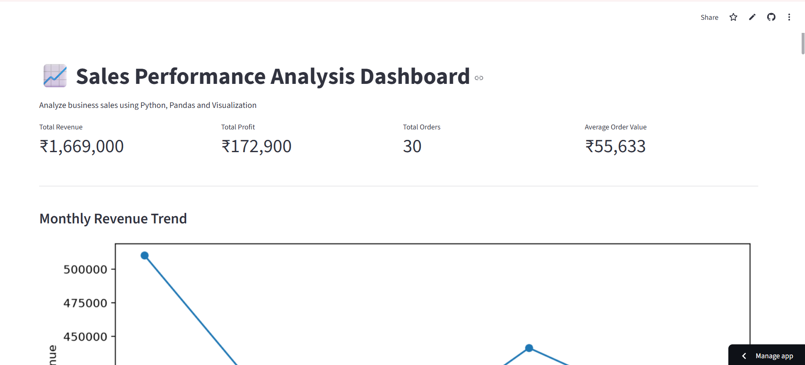

# Sales Performance Analysis

## Dashboard Preview

---

## 📌 Project Overview

This project analyzes sales data using Python to identify revenue trends, monthly performance, top-selling products, and business growth opportunities. The analysis supports data-driven business decisions through visualizations and key performance metrics.

---

## 🎯 Business Problem

Businesses need to understand sales performance across products, regions, and time periods to improve profitability and make informed strategic decisions.

---

## 🛠️ Tools & Technologies

- Python
- Pandas
- Matplotlib
- Microsoft Excel
- Jupyter Notebook

---

## 📊 Analysis Performed

- Monthly Sales Trend
- Revenue Analysis
- Top-Selling Products
- Sales by Category
- Business Performance Indicators
- Data Cleaning & Exploration

---

## 📂 Dataset

The dataset includes:

- Order ID
- Product Name
- Category
- Sales Amount
- Quantity
- Order Date
- Region

---

## 💡 Key Insights

- Identified monthly revenue trends.
- Highlighted top-performing products.
- Compared category-wise sales.
- Detected seasonal sales patterns.
- Supported business decision-making with visual insights.

---

## 📁 Files Included

- Sales_Performance_Analysis.ipynb
- Sales_Data.xlsx
- Project_Report.pdf

---

## 👩‍💻 Author

**Sushma Rakesh**

Power BI | SQL | Python | Business Analytics | GenAI
